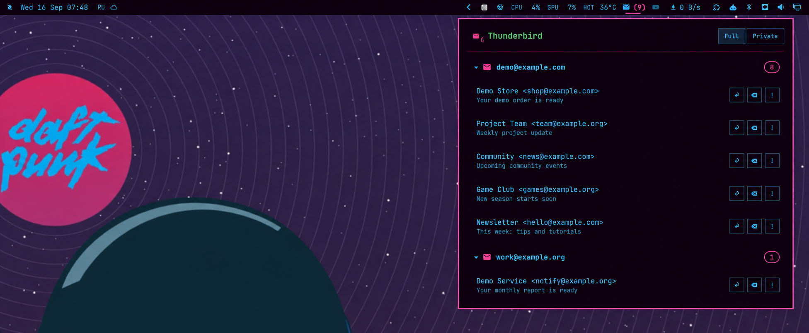

# Thunderbird Mail Checker

An Omarchy QuickShell bar widget for unread Thunderbird Inbox mail. It shows the total unread count, groups messages by account, and previews the five newest unread messages per account.



**Current versions:** Omarchy plugin `0.1.21` · Thunderbird MailExtension `0.1.5` · Thunderbird `128+`

## Features

- Updates after Thunderbird mail events, with a ten-minute reconciliation pass instead of continuous polling.
- Opens messages and provides Reply, Move to Trash, and Mark as spam actions through Thunderbird APIs.
- Shows starred and attachment indicators without reading message bodies.
- Supports Full notifications (sender and subject) and Private notifications (count only).
- Follows Thunderbird's English or Russian UI language and Omarchy's global Silence Notifications mode.
- Displays bridge health in the panel; click the Thunderbird icon to reconnect it.

## Installation

The widget and Thunderbird extension are installed separately.

```bash
omarchy plugin add https://github.com/VillainRU/omarchy-thunderbird-mail-checker.git --enable
~/.config/omarchy/plugins/io.github.villainru.thunderbird-mail-checker/bin/thunderbird-mail-checker setup
```

The second command registers the local native-messaging bridge and prints the bundled XPI path. In Thunderbird, open **Add-ons and Themes → Extensions → gear menu → Install Add-on From File**, select `thunderbird/thunderbird-mail-checker.xpi` from that path, accept the requested permissions, and restart Thunderbird once.

The widget starts in the right bar section. Move it when needed:

```bash
omarchy bar move io.github.villainru.thunderbird-mail-checker --section right
```

## Updating

```bash
omarchy plugin update io.github.villainru.thunderbird-mail-checker --yes
~/.config/omarchy/plugins/io.github.villainru.thunderbird-mail-checker/bin/thunderbird-mail-checker setup
```

If [CHANGELOG.md](CHANGELOG.md) lists a newer companion MailExtension, install the newly bundled XPI through Thunderbird again. Plugin and MailExtension versions are intentionally independent.

## How it works

The MailExtension reads Inbox counters, queries unread messages, and coalesces related mail events into one refresh. It caches attachment flags with bounded memory. A persistent native-messaging host forwards snapshots and actions over a user-only Unix socket, so the QuickShell panel does not spawn periodic helper processes.

No remote service is used. The bridge never accesses passwords, OAuth tokens, or message bodies. It stores only panel metadata in a mode-`0600` cache and renders Thunderbird-controlled text as plain text. Actions fail safely while Thunderbird is unavailable and are never queued across restarts.

## Troubleshooting

```bash
~/.config/omarchy/plugins/io.github.villainru.thunderbird-mail-checker/bin/thunderbird-mail-checker status
omarchy plugin validate ~/.config/omarchy/plugins/io.github.villainru.thunderbird-mail-checker
```

A red Thunderbird title means the bridge is offline. Confirm that Thunderbird is running, MailExtension `0.1.5` is enabled, and rerun `setup` if the plugin directory moved. Then click the Thunderbird icon in the panel or restart Thunderbird.

## Removal

Remove **Thunderbird Mail Checker** from Thunderbird first, then run:

```bash
omarchy plugin disable io.github.villainru.thunderbird-mail-checker
omarchy plugin remove io.github.villainru.thunderbird-mail-checker --yes
rm -f ~/.mozilla/native-messaging-hosts/io.github.villainru.thunderbird_mail_checker.json
```

Cached panel metadata can optionally be removed from `~/.local/state/thunderbird-mail-checker/`. Removing the plugin does not delete messages or account data.

## Development

`make xpi` rebuilds the companion extension. `make check` validates both manifests, JavaScript, Python and shell syntax, and runs the background and protocol regression tests. The native host uses only the Python 3 standard library; XPI packaging requires `zip`.
